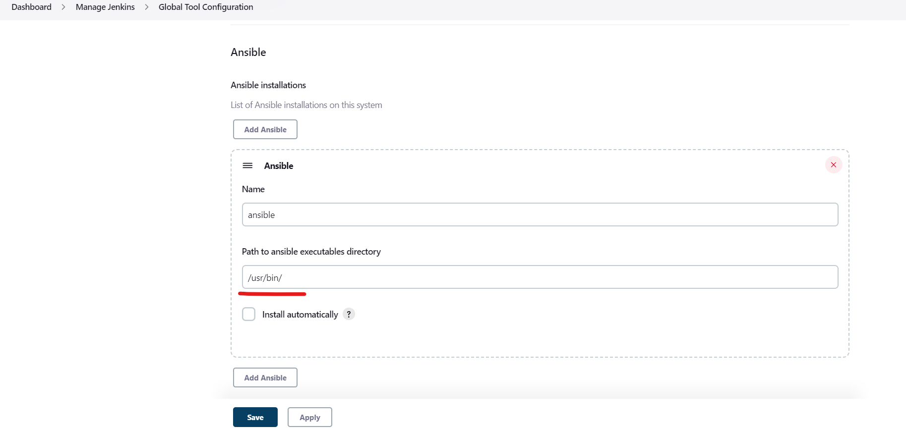
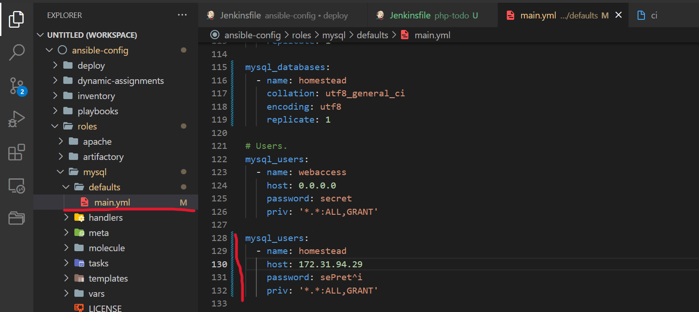
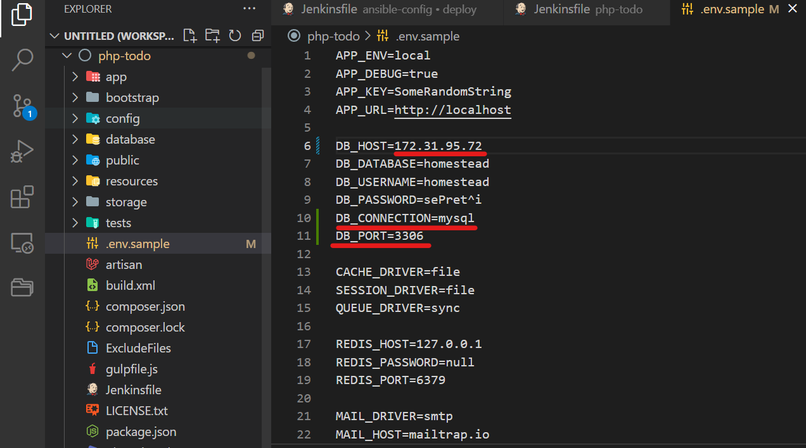

# Continuous Integration With Jenkins | Ansible | Artifactory | Sonarqube | PHP

In this project, the concept of CI/CD is implemented where a php application from github is pushed to Jenkins to run a multi-branch pipeline job(build job is run on each branches of a repository simultaneously) which is better viewed from Blue Ocean plugin. This is done in order to achieve continuous integration of codes from different developers. After which, the artifacts from the build job is packaged and pushed to sonarqube server for testing before it is deployed to artifactory from which ansible job is triggered to deploy the application to production environment.

## SIMULATING A TYPICAL CI/CD PIPELINE FOR A PHP BASED APPLICATION

First, navigate to Jenkins URL and install & Open Blue Ocean Jenkins Plugin:


Create a new pipeline and connect jenkins to github with an access token:


Create a new folder called `deploy` and inside create a file called Jenkinsfile with the code:

```
pipeline {
    agent any

  stages {
    stage('Build') {
      steps {
        script {
          sh 'echo "Building Stage"'
        }
      }
    }
    }
}
```

Go back into the Ansible pipeline in Jenkins, and select configure. in Build Configuration section, specify the location of the Jenkinsfile at deploy/Jenkinsfile:


Back to the pipeline and click on main and select build now. View project build in blue ocean:


Create a new git branch called feature/jenkinspipeline-stages: `git checkout -b feature/jenkinspipeline-stages`

Add another stage called Test in deploy/Jenkinsfile. Paste the code below and push the changes to git:

```
pipeline {
    agent any

  stages {
    stage('Build') {
      steps {
        script {
          sh 'echo "Building Stage"'
        }
      }
    }

    stage('Test') {
      steps {
        script {
          sh 'echo "Testing Stage"'
        }
      }
    }
    }
}
```


To make your new branch show up in Jenkins, we need to tell Jenkins to scan the repository:


Create a pull request to merge the latest code into the main branch. Add more stages to the Jenkinsfile to simulate `Package`, `Deploy` and `Clean up` stages:


Verify in Blue Ocean that all the stages are working:


After merging the PR, go back into your terminal and switch into the main branch: `git checkout main`. Pull latest change: `git pull`

Now install Ansible on Jenkins server. Then install Ansible plugin in Jenkins UI:


Launch a redhat instance named nginx and an ubuntu instance named DB. In deploy folder create an ansible configuration file named `ansible.cfg`. Add the following:

```
[defaults]
timeout = 160
callback_whitelist = profile_tasks
log_path=~/ansible.log
host_key_checking = False
gathering = smart
ansible_python_interpreter=/usr/bin/python3
allow_world_readable_tmpfiles=true


[ssh_connection]
ssh_args = -o ControlMaster=auto -o ControlPersist=30m -o ControlPath=/tmp/ansible-ssh-%h-%p-%r -o ServerAliveInterval=60 -o ServerAliveCountMax=60 -o ForwardAgent=yes
```

Update Jenkins credentials:


Configure Ansible in Jenkins:



Generate pipeline script:


Create Jenkinsfile from scratch that runs the ansible playbook:

```
pipeline {
  agent any

  environment {
      ANSIBLE_CONFIG="${WORKSPACE}/deploy/ansible.cfg"
    }

  stages{
      stage("Initial cleanup") {
          steps {
            dir("${WORKSPACE}") {
              deleteDir()
            }
          }
        }

      stage('Checkout SCM') {
         steps{
            git branch: '<name of git branch>', url: '<git repo url>'
         }
       }

      stage('Prepare Ansible For Execution') {
        steps {
          sh 'echo ${WORKSPACE}' 
          sh 'sed -i "3 a roles_path=${WORKSPACE}/roles" ${WORKSPACE}/deploy/ansible.cfg'  
        }
     }

      stage('Run Ansible playbook') {
        steps {
           ansiblePlaybook become: true, colorized: true, credentialsId: 'private-key', disableHostKeyChecking: true, installation: 'ansible', inventory: 'inventory/dev.yml', playbook: 'playbooks/site.yml'
         }
      }

      stage('Clean Workspace after build'){
        steps{
          cleanWs(cleanWhenAborted: true, cleanWhenFailure: true, cleanWhenNotBuilt: true, cleanWhenUnstable: true, deleteDirs: true)
        }
      }
   }

}
```
Update inventory file:


Update playbooks/site.yml:


Edit roles configuration to use correct credentials for MySQL required for the tooling website:

In roles/mysql directory, open up `defaults/main.yml`. Under databases and users uncomment all lines under each of these sections. Change name of database to tooling website DB name: `tooling`. Change name of users to `webaccess`. Change host to: `0.0.0.0` and then change priv to: `'*.*:ALL,GRANT'`

In nginx/tasks/main.yml: add the following:

```
---
# tasks file for nginx
- name: install nginx on the webserver
  ansible.builtin.yum:
      name: nginx
      state: present


- name: ensure nginx is started and enabled
  ansible.builtin.service:
     name: nginx
     state: started 
     enabled: yes

- name: install PHP
  ansible.builtin.yum:
    name:
      - php 
      - php-mysqlnd
      - php-gd 
      - php-curl
    state: present
```

Create static-assignments/nginx.yml and add the following:

```

---
- hosts: nginx
  become: true
  roles:
     - nginx

```

Upload changes to github and then ensure that Ansible runs against dev environment successfully:


To deploy to other environments, we will need to use parameters. In ansible-config-mgt/inventory create a new folder `sit`. Update `sit` inventory with new servers:

```
[tooling]
<SIT-Tooling-Web-Server-Private-IP-Address>

[todo]
<SIT-Todo-Web-Server-Private-IP-Address>

[nginx]
<SIT-Nginx-Private-IP-Address>

[db:vars]
ansible_user=ec2-user
ansible_python_interpreter=/usr/bin/python

[db]
<SIT-DB-Server-Private-IP-Address>
```

Update Jenkinsfile to introduce parameterization:

```

pipeline {
    agent any

    parameters {
      string(name: 'inventory', defaultValue: 'dev.yml',  description: 'This is the inventory file for the environment to deploy configuration')
    }
...

```

In the Ansible execution section, remove the hardcoded inventory/dev.yml and replace with `inventory/${inventory}`


Upload chanes to github. Create a Pull Request and merge it to main branch on GitHub. On terminal git chekout main -> `git pull`

## Setting Up The Artifactory Server

Create a new redhat instance named `artifactory` and create security group inbound rule for port 8081 and 8082. In jenkins-ansible server update Ansible with an Artifactory role. Update ci inventory with artifactory instance private ip:


Create `static assignment/artifactory.yml` and update `artifactory.yml` with the following:

```

---
- hosts: artifactory
  become: true
  roles:
    - artifactory
    
```

Update site.yml with the following:

```

---

 - hosts: artifactory
 - name: artifactory assignment
   ansible.builtin.import_playbook: ../static-assignments/artifactory.yml
   
```

## Configure Jenkins Server

On Jenkins server, install PHP, its dependencies and Composer tool:

```

# ubuntu:
sudo apt install -y zip libapache2-mod-php phploc php-{xml,bcmath,bz2,intl,gd,mbstring,mysql,zip}


#redhat:
- yum module reset php -y
- yum module enable php:remi-7.4 -y
- yum install -y php  php-common php-mbstring php-opcache php-intl php-xml php-gd php-curl php-mysqlnd    php-fpm php-json
- systemctl start php-fpm
- systemctl enable php-fpm
- curl -sS https://getcomposer.org/installer | php 
- sudo mv composer.phar /usr/bin/composer
- composer --version

```


Install Jenkins plugins Plot and Artifactory:


Ensure artifactory is installed: artifactory public ip:8081


Create local repository:


In Jenkins UI configure Artifactory: jenkins dashboard -> manage jenkins -> configure systems


## Integrate Artifactory repository with Jenkins

Fork the repository below into your GitHub account: https://github.com/darey-devops/php-todo.git

Create a Jenkinsfile in the php-todo repository:


Ensure mysql is installed on php-todo:

`sudo yum install mysql`

In database server, change bind address to `0.0.0.0`:

`sudo vi /etc/mysql/mysql.conf.d/mysqld.cnf`


On the jenkins-ansible server, create a new database and user with the following:



Upload changes to gitub and run ansible in jenkins to create new database:


Using Blue Ocean, create a multibranch Jenkins pipeline:


In php-todo folder, update the database connectivity requirements in the file `.env.sample`:

```
DB_HOST=<Database server private ip>
DB_DATABASE=homestead
DB_USERNAME=homestead
DB_PASSWORD=sePret^i
DB_CONNECTION=mysql
DB_PORT=3306

```



Upload changes to github and run pipeline in jenkins:


Update the Jenkinsfile to include Unit tests step:


Structuring Jenkins File: Code Quality Analysis:

In php-todo terminal, install phploc:

`sudo dnf --enablerepo=remi install php-phpunit-phploc`


Add the code analysis and plot step in Jenkinsfile:


Run build:


Install zip: 

`sudo yum install zip -y`

Add the application code for into an artifact (archived package) upload to Artifactory:

```

stage ('Package Artifact') {
   steps {
           sh 'zip -qr php-todo.zip ${WORKSPACE}/*'
    }
   }
   
```

Publish the resulted artifact into Artifactory:

```

stage ('Upload Artifact to Artifactory') {
         steps {
           script { 
                def server = Artifactory.server 'artifactory-server'                 
                def uploadSpec = """{
                   "files": [
                     {
                      "pattern": "php-todo.zip",
                      "target": "<name-of-artifact-repository>/php-todo",
                      "props": "type=zip;status=ready"

                      }
                   ]
                }""" 

                server.upload spec: uploadSpec
              }
           }

       }
       
```


Deploy the application to the dev environment by launching Ansible pipeline:

```

stage ('Deploy to Dev Environment') {
   steps {
   build job: '<ansible-project-name>/main', parameters: [[$class: 'StringParameterValue', name: 'env', value: 'dev']], propagate: false, wait: true 
 }
 ```

Launch a new redhat instance named `todo` and update dev inventory with todo ip address:


Create a new static assignment file named deployment.yml and add the following:

```

---
- name: Deploying the PHP Applicaion to Dev Enviroment
  become: true
  hosts: todo

  tasks:
    - name: install remi and rhel repo
      ansible.builtin.yum:
        name: 
          - https://dl.fedoraproject.org/pub/epel/epel-release-latest-8.noarch.rpm
          - dnf-utils
          - http://rpms.remirepo.net/enterprise/remi-release-8.rpm
        disable_gpg_check: yes

    
    - name: install httpd on the webserver
      ansible.builtin.yum:
        name: httpd
        state: present

    - name: ensure httpd is started and enabled
      ansible.builtin.service:
        name: httpd
        state: started 
        enabled: yes
      
    - name: install PHP
      ansible.builtin.yum:
        name:
          - php 
          - php-mysqlnd
          - php-gd 
          - php-curl
          - unzip
          - php-common
          - php-mbstring
          - php-opcache
          - php-intl
          - php-xml
          - php-fpm
          - php-json
        enablerepo: php:remi-7.4
        state: present
    
    - name: ensure php-fpm is started and enabled
      ansible.builtin.service:
        name: php-fpm
        state: started 
        enabled: yes

    - name: Download the artifact
      get_url:
        url: http://3.125.156.235:8082/artifactory/PBL/php-todo
        dest: /home/ec2-user/
        url_username: <artifactory username>
        url_password: <artifactory password> 


    - name: unzip the artifacts
      ansible.builtin.unarchive:
       src: /home/ec2-user/php-todo
       dest: /home/ec2-user/
       remote_src: yes

    - name: deploy the code
      ansible.builtin.copy:
        src: /home/ec2-user/var/lib/jenkins/workspace/php-todo_main/
        dest: /var/www/html/
        force: yes
        remote_src: yes

    - name: remove nginx default page
      ansible.builtin.file:
        path: /etc/httpd/conf.d/welcome.conf
        state: absent

    - name: restart httpd
      ansible.builtin.service:
        name: httpd
        state: restarted
```

Get encrypted password from artifactory. Click set me up and under configure enter artifactory password and press green button. Under deploy: copy encrypted password.


Update site.yml:

```

---

- hosts: todo
- name: Deploy the todo application
   ansible.builtin.import_playbook: ../static-assignments/deployment.yml
```

Upload changes to github and build job in jenkins and ensure job in both pipelines, ansible-config-mgt and php-todo are successful:


## Install And Configure SonarQube Server

Launch an ubuntu instance named sonarqube. Create ansible role for sonarqube in ansible-config-mgt/roles. Create a new sonarqube directory withansible-galaxy install capitanh.sonar_ansible_role. In static assignment add new file: sonar.yml and add the following:

```

---
- hosts: sonar
  become: true
  roles:
     - sonarqube

```

Update CI inventory with sonarqube private ip:


Update site.yml:

```
---

 - hosts: sonar
 - name: sonar assignment
   ansible.builtin.import_playbook: ../static-assignments/sonar.yml

```

Build a job in jenkins with CI parameters:


Access sonarqube: sonarqube ip : 9000/sonar


Log in to sonarqube with default administrator username and password: admin

In Jenkins, install SonarQube Scanner plugin. Navigate to configure system in Jenkins. Add SonarQube server as shown below:


Generate authentication token in SonarQube: User > My Account > Security > Generate Tokens


Configure Quality Gate Jenkins Webhook in SonarQube – The URL should point to Jenkins server http://{JENKINS_HOST}/sonarqube-webhook/


Setup SonarQube scanner from Jenkins – Global Tool Configuration :


Update Jenkins Pipeline to include SonarQube scanning and Quality Gate. This should be before the pacakgeartifact stage. Below is the snippet for a Quality Gate stage in php-todo Jenkinsfile:

```

stage('SonarQube Quality Gate') {
        environment {
            scannerHome = tool 'SonarQubeScanner'
        }
        steps {
            withSonarQubeEnv('sonarqube') {
                sh "${scannerHome}/bin/sonar-scanner"
            }

        }
    }

```

Configure sonar-scanner.properties by going into the tools directory on the server to configure the properties file in which SonarQube will require to function during pipeline execution:

`cd /var/lib/jenkins/tools/hudson.plugins.sonar.SonarRunnerInstallation/SonarQubeScanner/conf/`

`sudo vi sonar-scanner.properties`

Add configuration related to php-todo project:

```

sonar.host.url=http://<SonarQube-Server-IP-address>:9000
sonar.projectKey=php-todo
#----- Default source code encoding
sonar.sourceEncoding=UTF-8
sonar.php.exclusions=**/vendor/**
sonar.php.coverage.reportPaths=build/logs/clover.xml
sonar.php.tests.reportPath=build/logs/junit.xml
```

Navigate to php-todo project in SonarQube:


Update Jenkinsfile to implement this:

```
stage('SonarQube Quality Gate') {
      when { branch pattern: "^develop*|^hotfix*|^release*|^main*", comparator: "REGEXP"}
        environment {
            scannerHome = tool 'SonarQubeScanner'
        }
        steps {
            withSonarQubeEnv('sonarqube') {
                sh "${scannerHome}/bin/sonar-scanner -Dproject.settings=sonar-project.properties"
            }
            timeout(time: 1, unit: 'MINUTES') {
                waitForQualityGate abortPipeline: true
            }
        }
    }
```

## Introduce Jenkins agents/slaves

Add 2 more servers to be used as Jenkins slave. Launch 2 red hat instances called jenkins slave.Connect to jenkins slave from local terminal and install java snd dependencies:

```

- sudo yum install java-11-openjdk-devel -y
- yum install -y https://dl.fedoraproject.org/pub/epel/epel-release-latest-8.noarch.rpm
- yum install -y dnf-utils http://rpms.remirepo.net/enterprise/remi-release-8.rpm

# open the bash profile 
- vi .bash_profile 

# paste the below in the bash profile
export JAVA_HOME=$(dirname $(dirname $(readlink $(readlink $(which javac)))))
export PATH=$PATH:$JAVA_HOME/bin
export CLASSPATH=.:$JAVA_HOME/jre/lib:$JAVA_HOME/lib:$JAVA_HOME/lib/tools.jar

# reload the bash profile
- source ~/.bash_profile

```

Configure Jenkins to run its pipeline jobs randomly on any available slave nodes. In jenkins, create a new node named agent_1: manage jenkins -> manage nodes and clouds

configure agent_1:

1) remote root directory: home/ec2-user/
2) launch method: mauch agent via ssh
3) host: jenkins slave private ip
4) credentials: ec2-user credentials created at the start of the project that is stored on jenkins
5) host verification strategy: non-verifying verifaction strategy


Configure webhook between Jenkins and GitHub to automatically run the pipeline when there is a code push. Payload url: jenkins url:8080/github-webhook

Project Complete